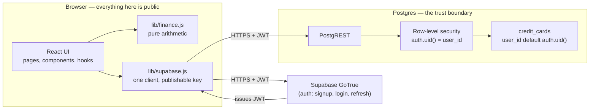

# nest

A debt dashboard that tells you, in dollars, what carrying your credit card balances costs you every month.

**Live demo → [nest-finance-nine.vercel.app](https://nest-finance-nine.vercel.app)**

<!-- DEMO GIF GOES HERE — dashboard bleed meter, strategy toggle, simulator slider.
     Drop the file at docs/demo.gif and replace this comment with:
      -->

## What it's for

Most budgeting apps look backwards: they categorize what you already spent and show you a pie chart of it. That's a useful thing to know and a bad thing to act on, because the money you spent is gone. nest asks a different question — what is your debt costing you *right now*, before you do anything at all?

The answer is the **interest bleed meter**, the number at the top of the dashboard: the sum of every card's monthly interest, labeled "Leaving your pocket every month," with the twelve-month projection under it and a one-line clarification that none of it reduces what you owe. It's the same arithmetic on a statement, but a statement shows one card and shows a payment received. This shows all of them and shows what you got for nothing. If the numbers for any card are unusable, the total refuses to render rather than quietly summing the rows it likes — an understated bleed figure is worse than no figure.

## Features (v0.1)

- Email/password auth via Supabase, with a protected `/dashboard` route.
- Card CRUD — name, issuer, balance, APR, credit limit, minimum due, due date — validated client-side against the same rules the table's CHECK constraints enforce.
- Interest bleed meter: monthly and annual interest across all cards, with an animated count-up on the headline figure (the only animation in the app; disabled under `prefers-reduced-motion`).
- Overall credit utilization, drawn against the 30% threshold lenders look for, computed as total balances over total limits rather than as an average of per-card ratios.
- A "Balance growing" badge on any card whose monthly interest exceeds its minimum payment.
- Payoff ordering — avalanche (highest APR first) or snowball (smallest balance first) — with a per-card rank badge and APR heat shading. The choice persists in `localStorage`.
- Payoff simulator: a $0–$1,000 extra-payment slider, showing debt-free date, total interest paid, interest saved, and months saved, plus a Recharts line comparing the balance curve with and without the extra payment.
- A stated verdict in words when the debt never clears — on minimums alone, or even with the extra.

## Tech stack

| | |
|---|---|
| React 19 | The app is one screen of derived state; components re-deriving from a card list is the whole architecture. |
| Vite 8 | Dev server with HMR, and `import.meta.env` handles the environment split without a config layer. |
| React Router 7 | Four routes, and the auth gate belongs in the route table where it's visible. |
| Supabase | Postgres, auth, and row-level security in one service — no backend to write or deploy. |
| Recharts | The only chart in the app is a two-series line chart; a full viz library would be more code than the chart. |
| Vanilla CSS + custom properties | Design tokens in `src/styles/tokens.css`; no component CSS hardcodes a color or a pixel value. |
| Vercel | Static hosting plus the SPA rewrite in `vercel.json`, which is all a client-routed build needs. |

## Architecture



Authorization lives in the database, not the client. Every request carries the user's JWT; Postgres reads the user id out of it with `auth.uid()` and four RLS policies compare that to `user_id` on each row, so a `select` returns only your cards no matter what the client asked for. `user_id` isn't in any insert payload either — the column defaults to `auth.uid()`, so the value written and the value checked come from the same call on the same request, and the browser has no way to name a different owner.

That's what makes shipping the publishable (anon) key in the bundle a non-issue. It identifies the project and carries no privileges of its own; anyone who extracts it gets exactly the access an anonymous visitor already has. A client-side filter like `.eq("user_id", me)` would be the opposite arrangement — a rule enforced by code the attacker controls.

## The formulas

Implemented in [`src/lib/finance.js`](src/lib/finance.js). Every dollar amount is rounded to the cent at the moment it becomes an amount, so intermediate float residue doesn't accumulate through the sums.

```js
// UNITS: balance, credit_limit, min_due are dollars.
//        apr_pct is a spoken percent — 24.99 means 24.99%.
//        The /100 lives in monthlyInterest and in the simulator's per-month
//        rate, and nowhere else — no component or formatter divides it.
//
// round2 is Math.round(x * 100) / 100 — money is decimal, floats are not.

monthlyInterest(card)   = round2( balance * (apr_pct / 100 / 12) )
totalMonthlyBleed(cards)= round2( Σ monthlyInterest(card) )   // null if any card is unusable
annualBleed(cards)      = round2( totalMonthlyBleed * 12 )     // derived, not re-computed from APRs

cardUtilization(card)   = balance / credit_limit               // null unless credit_limit > 0
overallUtilization(cs)  = Σ balance / Σ credit_limit           // NOT the mean of per-card ratios
isUtilizationHigh(r)    = r > 0.30                             // strictly greater; 30% exactly passes

balanceGrowsFlag(card)  = monthlyInterest(card) > min_due      // false, not null, when unknown

aprHeat(card, cards)    = (apr - minApr) / (maxApr - minApr)   // 1 when every rate is equal
```

`apr_pct / 12` is a display approximation, not the method your issuer uses. Card issuers bill on the average daily balance across a statement cycle, compounding daily against a periodic rate — which needs a cycle close date, a payment date, and a transaction history, none of which this app has. Dividing the annual rate by twelve answers "what did this month cost me" honestly with the data available; inventing the missing inputs would make the figure look more precise and be less true.

## The payoff simulator

`simulatePayoff(cards, extraPayment, strategy, today)` runs a month-by-month loop rather than a closed-form expression. There is an exact formula for clearing a *single* balance at a fixed payment — it just answers a different problem. The thing being modeled is a *set* of balances where the events that matter are discrete: the target card switches the instant one hits zero, a cleared card's minimum isn't saved but rolled onto the next card, and the payment order is recomputed each month over whatever still has a balance (under snowball, the smallest balance changes hands as cards shrink). A formula that assumed those away would be very precise about an easier question.

Each iteration: charge interest on every balance, pay each card's minimum capped at what it owes, sweep every unspent dollar of minimum plus the extra into a pool, then throw the whole pool at the current target — cascading to the next card if the pool overshoots.

Termination is checked up front, not discovered by the loop. The monthly outlay is constant (freed minimums are recycled), so if it doesn't exceed the first month's interest the balance grows forever; that returns `clears: false` with null figures, which the UI states in words. When it does exceed, the balance strictly falls and the loop provably ends. A 600-month cap sits behind that as a backstop.

## Running it locally

```bash
git clone https://github.com/ng8nestor/nest-finance.git
cd nest-finance
npm install
cp .env.example .env.local
```

Fill in `.env.local` with your Supabase project URL and publishable (anon) key, both from the project's API settings:

```
VITE_SUPABASE_URL=
VITE_SUPABASE_ANON_KEY=
```

Run [`docs/schema.sql`](docs/schema.sql) in the Supabase SQL editor to create the `credit_cards` table, enable RLS, and install the four ownership policies. Then:

```bash
npm run dev
```

Vite reads `.env.local` once at startup, so restart the dev server after editing it. Missing variables throw a named error at boot rather than an opaque failure on first login.

## Roadmap

**Not built. Nothing below exists in the code.**

- **v0.2** — Conscious Spending Plan (budget buckets) and the income/paycheck engine.
- **v0.3** — Sinking funds, goals, and an emergency fund.
- **Later** — The payment allocation engine, and an in-app AI assistant that reads real financial state and runs what-if scenarios.
